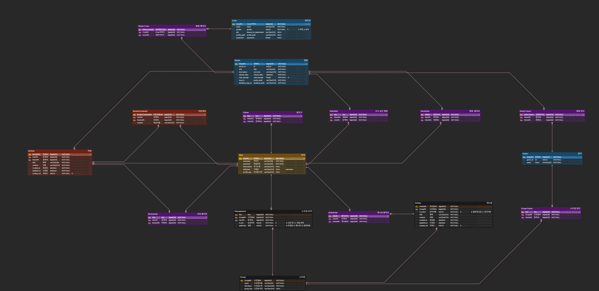

# 8기 FINAL 관통 PJT
# 팀 심창민
  ## 팀원 정보
   - 팀장: 심재원
   - 팀원: 이창민
  ## 업무 분담
  ### 심재원
    - 백엔드 모델링, 계정, 소모임
  ### 이창민
    - 영화(알고리즘 포함), 데이터 크롤링, 리뷰
---
# 규칙
  ## git 규칙
    - 각자의 branch에서 작업
    - 한 단위 끝날 때마다 commit
    - 하루 한 번 push
    - 팀장이 pull request 확인 후 merge
  ### commit message 작성법
    - 첫번째 줄에 수정한 것에 대한 요약
    - 두번째 줄 비움
    - 세번째 줄에 상세한 작업 내역 작성
      1. 완료한 작업
      2. 진행중인 작업 (있다면)
      3. 어떠한 기능을 구현했는지 작성
  ### PR(pull request) 방법
    - 제목에 PR날짜, commit들을 통합해서 요약
    - 내용 생략
---
# 목표 서비스
  ## 영화
  - 관심사에 맞춘 영화 추천 서비스
  ## 커뮤니티
  - 영화커뮤니티 생태계 발전을 위한 소모임
---
# 실제 구현 정도
  | 목표 |시작날짜|목표날짜|완료날짜|
  |-----|-------|------|--------|
  아이디어|22.11.16|22.11.17|
  목업 구성|22.11.16|22.11.18|22.11.16
  erdcloud|22.11.17|22.11.18|22.11.17
  규칙정하기(커밋 규칙/풀 리퀘스트 규칙 포함)|22.11.17|22.11.18|22.11.17
  api 정리|22.11.17|22.11.18|22.11.17
  데이터 수집|22.11.18|22.11.20|
  계정 구현|22.11.18|22.11.19|
  영화 구현|22.11.19|22.11.20|
  리뷰 구현|22.11.18|22.11.19|
  소모임 구현|22.11.19|22.11.21|
  검색 구현|22.11.21|22.11.22|
  영화 추천 알고리즘|22.11.19|22.11.21|
---

# 목업

---

# erd 작성

---

# api 명세

---
