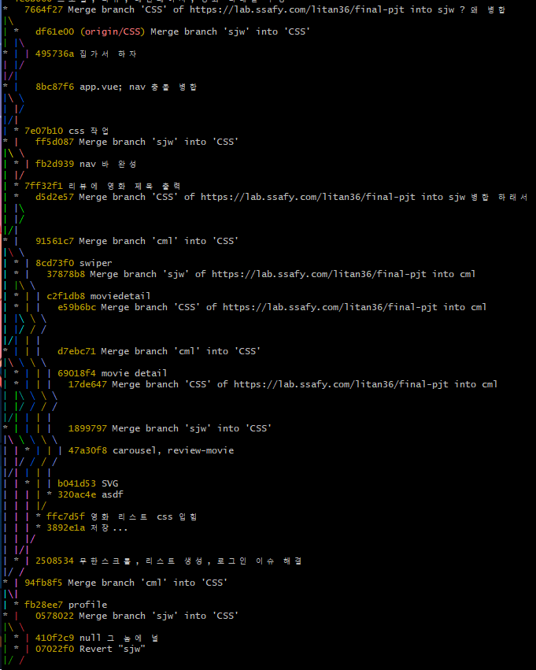

# 8기 FINAL 관통 PJT
# 팀 심창민
  ## 팀원 정보
   - 팀장: 심재원
   - 팀원: 이창민
  ## 업무 분담
  ### 심재원
    - 백엔드 모델링, 계정, 소모임(취소), 영화 알고리즘, 영화 리스트 페이지, 시연
  ### 이창민
    - 데이터 크롤링, 리뷰, 메인페이지, 영화 디테일페이지, 발표
---
# 규칙
  ## git 규칙
    - 각자의 branch에서 작업
    - 한 단위 끝날 때마다 commit
    - 하루 한 번 push
    - 팀장이 pull request 확인 후 merge
  ### commit message 작성법
    - 첫번째 줄에 수정한 것에 대한 요약
    - 두번째 줄 비움
    - 세번째 줄에 상세한 작업 내역 작성
      1. 완료한 작업
      2. 진행중인 작업 (있다면)
      3. 어떠한 기능을 구현했는지 작성
  ### PR(pull request) 방법
    - 제목에 PR날짜, commit들을 통합해서 요약
    - 내용 생략
---
# 목표 서비스
  ## 영화
  - 관심사에 맞춘 영화 추천 서비스
  ## 커뮤니티
  - 영화커뮤니티 생태계 발전을 위한 소모임
---
# 실제 구현 정도
  | 목표 |시작날짜|목표날짜|완료날짜|진행상황|
  |-----|-------|------|--------|-----|
  아이디어|22.11.16|22.11.17|22.11.17|완료  
  목업 구성|22.11.16|22.11.18|22.11.16|완료
  erdcloud|22.11.17|22.11.18|22.11.17|완료
  규칙정하기(커밋 규칙/풀 리퀘스트 규칙 포함)|22.11.17|22.11.18|22.11.17|완료
  api 정리|22.11.17|22.11.18|22.11.17|완료
  데이터 수집|22.11.18|22.11.20|22.11.18|완료
  계정 구현|22.11.18|22.11.19|22.11.21|완료
  영화 구현|22.11.19|22.11.20|22..11.25|완료
  리뷰 구현|22.11.18|22.11.19|22.11.21|css남음
  소모임 구현|22.11.19|22.11.21||폭파  
  검색 구현|22.11.21|22.11.22|22.11.24|완료
  영화 추천 알고리즘|22.11.19|22.11.21|22.11.25|완료
---

# 목업


---

# erd

---

# api 명세

---

# git



---

# 영화추천알고리즘
1. 사용자가 좋아요한 영화, 다음에 보고싶은 영화를 분석하여 가장 선호하는 장르 추출
2. 장르 기반으로 popularity가 높은 것을 출력

# 서비스 대표 기능
- 각 영화마다 리뷰 작성 가능
- 리뷰는 게시글 형식으로 작성이 가능
- 작성한 모습 그대로 게시글 출력
- 해당 영화에 대한 심도깊은 분석글을 올릴 수 있음
  - 댓글을 통해 이에 대한 토론을 할 수 있음

# 느낀점
- 심재원
```
공부할 때는 모두 쉽게만 느껴졌지만 막상 프로젝트를 시작하니 여기저기 어려운 부분이 많았습니다.
또한 구현하는데 필요한 시간이 부족하여 하고 싶은 것을 못하는 경우가 많았습니다. 
특히 사소한 부분이지만 사용자 경험에 많은 영항을 미치는 부분이 많았고, 그러한 것을 구현하지 못하는 경우가 많아 아쉬웠습니다.

기능은 어찌어찌 구현한다고 하더라도 CSS는 또 다른 문제라는 것을 알게 되었습니다.
다음 프로젝트에서는 창민이와 같이 기능 구현을 잘하는 팀원 뿐만아니라 디자인 또한 잘하는 팀원이 필요하다는 것을 느꼈습니다.

git을 열심히 활용해보는 경험이었습니다. git 사용 중 한 번은 파일이 날아갔던 적이 있었는데, 그 동안 꾸준히 commit을 하고 만약을 위해 branch를 사용한 덕분에 큰 문제없이 해결할 수 있었습니다.
```
- 이창민
```
따라가기 벅차지만 매주 금요일마다 주어진 명세서대로 프로젝트를 완성할때마다 보람차고 자신감을 얻었습니다. 
하지만, 새로 만드는 작업은 구상부터 모델 설계 및 구현, 디자인을 하는것이고, 이는 정말 어려움을 깨닫게 되는 계기가 되었습니다.

앞으로의 프로젝트에 있어, 역할분담이 프론트엔드와 백엔드로 나뉨의 이유를 알게 되었고, 의사소통의 중요성을 알게 되는 경험이 되었습니다.
```